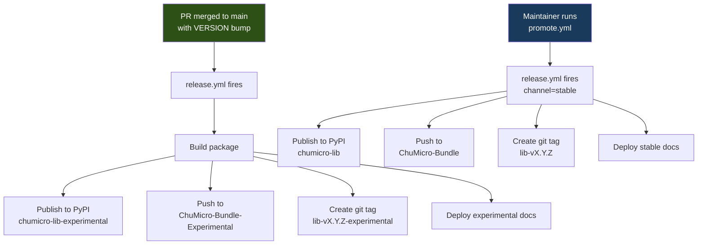

# Releases

Chumicro uses a two-channel release model: **experimental** (automatic) and **stable** (promoted by a maintainer). This page explains how releases work and how to request a stable promotion.

## Release pipeline



## Experimental releases

**Automatic.** When a PR that bumps a library's `VERSION` file merges to `main`, the release workflow fires immediately. No manual steps.

What happens:

1. The package is built and published to PyPI as `chumicro-<name>-experimental`
2. Files are pushed to the [experimental bundle repo](https://github.com/ChuMicro/ChuMicro-Bundle-Experimental)
3. A git tag is created: `<name>-v<version>-experimental`
4. Experimental docs are deployed

Users install experimentals the same way as stable — just from the experimental channel:

```bash
# CircuitPython (circup)
circup bundle-add ChuMicro/ChuMicro-Bundle-Experimental
circup install chumicro-timing

# MicroPython (mip)
mpremote mip install github:ChuMicro/ChuMicro-Bundle-Experimental/chumicro_timing

# CPython (pip)
pip install chumicro-timing-experimental
```

## Stable releases

**Manual — by request.** A maintainer runs the `promote.yml` workflow from the experimental tag. This is a deliberate step to ensure only verified code reaches production users.

What happens:

1. `promote.yml` validates the experimental tag and VERSION file
2. The package is built and published to PyPI as `chumicro-<name>` (the production name)
3. Files are pushed to the [stable bundle repo](https://github.com/ChuMicro/ChuMicro-Bundle)
4. A stable git tag is created: `<name>-v<version>`
5. Stable docs are deployed

## How to request a stable promotion

Only maintainers can run `promote.yml`. To request a promotion:

1. **Open an issue** using the [Stable Promotion Request](https://github.com/ChuMicro/ChuMicro/issues/new?template=stable_promotion.yml) template
2. Fill in the library name, experimental tag, and verification checklist
3. A maintainer will review and run `promote.yml` if everything checks out

What maintainers look for:

- The experimental release has been tested (at least: preflight passes, ideally: used on real hardware)
- No known bugs or regressions
- Docs are complete and accurate
- The API is intentional (once stable, breaking changes require a major version bump)

## Channels and package names

The experimental and stable channels use **different package names** on PyPI but **identical import paths** on-device:

| | Experimental | Stable |
|---|---|---|
| **PyPI package** | `chumicro-timing-experimental` | `chumicro-timing` |
| **Bundle repo** | `ChuMicro-Bundle-Experimental` | `ChuMicro-Bundle` |
| **Git tag** | `timing-v0.2.0-experimental` | `timing-v0.2.0` |
| **Import path** | `chumicro_timing` | `chumicro_timing` |

Switching from experimental to stable is a drop-in replacement — no code changes needed on the device.

## Versioning

Each library has a `VERSION` file at its root (e.g., `libraries/timing/VERSION`). This is the single source of truth. `pyproject.toml` reads from it dynamically.

**Semantic versioning rules:**

| Change | Bump | VERSION example |
|---|---|---|
| Bug fix, no API change | Patch | `0.1.15` → `0.1.16` |
| New feature, backward-compatible | Minor | `0.1.15` → `0.2.0` |
| Breaking API change | Major | `0.1.15` → `1.0.0` |

**When to bump:** any PR that changes library source code (under `src/`). CI enforces this with `check-version`. You don't need to bump for changes to tests, docs, examples, or infrastructure.

**Libraries version independently.** Bumping `timing` does not affect `runner`. Each library has its own release cadence.

## Release branches (rare)

If a stable release needs a hotfix but `main` has moved on with breaking changes:

```bash
# Branch from the stable tag
git checkout -b release/timing-v0.2.x timing-v0.2.0

# Fix the bug, bump VERSION to 0.2.1
# ... make changes ...

# A maintainer runs release.yml manually on this branch
# Cherry-pick the fix back to main
```

Release branches are short-lived — created for the patch, deleted after release. This is a rare workflow; most fixes go directly to `main`.

## FAQ

**Q: Can I publish a stable release myself?**
A: Not yet. Only maintainers can run `promote.yml`. Open a [promotion request issue](https://github.com/ChuMicro/ChuMicro/issues/new?template=stable_promotion.yml) and a maintainer will handle it.

**Q: What if I bump VERSION but my PR fails CI?**
A: No release happens until the PR merges to `main`. Fix CI, push again. The VERSION bump stays in your PR.

**Q: Can I release just one library?**
A: Yes. Libraries release independently. Bumping one library's VERSION has no effect on other libraries.

**Q: What if I accidentally bump VERSION for a docs-only change?**
A: The release will fire on merge. It's not harmful (the package just gets a new version with no functional change), but it's unnecessary. Avoid it by only bumping VERSION when source code changes.

