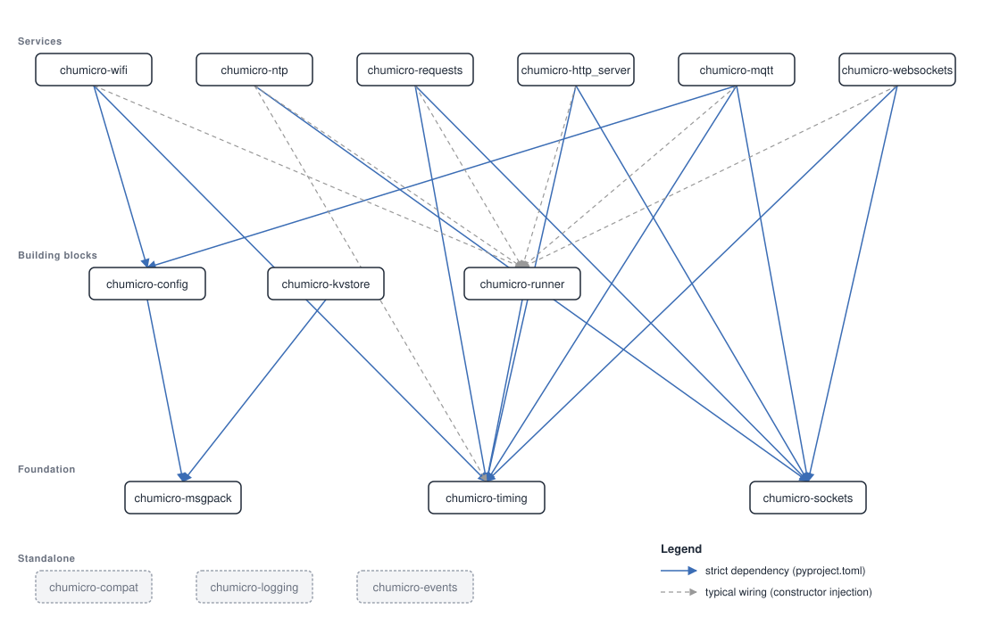

# ChuMicro libraries

Small, focused libraries for microcontrollers and laptops.  Every library installs independently and depends on as little as possible.  The ones with ongoing work to do (WiFi, the network protocols, anything that waits on I/O) share one cooperative-loop contract so [`runner`](runner/) can drive them in a single loop; the rest (like `msgpack` and `compat`) are plain importable code.

 

> Looking for the project README?  → [`/README.md`](../README.md) covers what ChuMicro is, worked examples, install, and next steps.
>
> Looking for host-side tools?  → [`/workbench/`](../workbench/) has the laptop tools for deploy, REPL, and project workspaces.

## What's in the box?

| Library | What it does |
|---|---|
| **[timing](timing/)** | Timers that don't freeze your code.  Your loop keeps running while the clock runs down; no `time.sleep()` locking everything up. |
| **[runner](runner/)** | The task scheduler.  Register your services, call `runner.tick()` in your loop, everyone gets a turn.  No async needed. |
| **[buttons](buttons/)** | Debounced buttons, switches, and key matrices.  Presses are captured beneath your loop, so a tap lands even when the loop is busy elsewhere. |
| **[knobs](knobs/)** | Rotary encoders and analog knobs.  Quadrature is counted outside your loop, and ADC readings are held still by a median, smoothing, and a deadband. |
| **[screens](screens/)** | Paced display flushing.  Draw the frame, call `show()`, and the flush crosses the bus one bounded transfer per tick instead of stalling the loop. |
| **[compat](compat/)** | Standard-library features that CircuitPython and MicroPython are missing (like `functools.partial`). |
| **[msgpack](msgpack/)** | Compact binary serialization, smaller than JSON for typical payloads.  Good for settings and sensor data.  Wire-compatible with PyPI `msgpack(use_single_float=True)`. |
| **[config](config/)** | Type-checked runtime config with a shared dotted-key shape (`wifi.ssid`, `mqtt.broker.host`); each library reads its settings via `<Name>Config.from_config(...)`. |
| **[kvstore](kvstore/)** | Tiny persistent key-value store for counters, timestamps, and tokens.  Picks the right backend (NVM / NVS / LittleFS) for your board. |
| **[wifi](wifi/)** | One WiFi service across CircuitPython and MicroPython, ESP32 and Pi Pico W alike.  State machine, reconnect supervisor, no firmware-level surprises. |
| **[sockets](sockets/)** | TCP, TLS, and UDP sockets that behave the same on CircuitPython, MicroPython, and CPython, smoothing over each runtime's own socket quirks.  The layer under the network libraries here, and usable directly. |
| **[ntp](ntp/)** | Sets the board's clock from the network without blocking the loop.  Pure Python; close enough to UTC for TLS certificate checks. |
| **[requests](requests/)** | Non-blocking HTTP/1.1 client.  The LED keeps blinking through a TLS handshake, a timeout, or a stalled peer. |
| **[http_server](http_server/)** | Non-blocking HTTP/1.1 server.  `@server.route` decorator with method dispatch and path params; each connection advances one chunk per tick.  TLS where the runtime supports it; the guide has the current support table. |
| **[mqtt](mqtt/)** | Non-blocking MQTT 3.1.1 client (QoS 0 and 1).  Runner-shaped, no threads or async.  Concurrent QoS 1 publishes, configurable oversized-message policy, last will and retain. |
| **[websockets](websockets/)** | Non-blocking WebSocket client and server.  RFC 6455 framing and masking, runner-shaped, plays alongside [`http_server`](http_server/) for combined HTTP/WS deployments. |

Hardware-validated on the project bench: RP2040 (Raspberry Pi Pico W, both runtimes) and ESP32 boards from the classic, S2, and S3 families.  ESP32-C3 / C6 and RP2350 are supported architectures that haven't had bench time yet.  Boards beyond these (STM32, nRF52840, and anything else running CircuitPython or MicroPython with at least 256 KB of RAM and 2 MB physical / ~800 KB usable flash) should work but haven't been validated.

## Install

See [the install guide](https://chumicro.com/ChuMicro/guides/install/) for the full install matrix: CircuitPython via circup, MicroPython via mip, CPython via pip, the experimental channel, and pre-compiled `.mpy` bundles.

Each library's own README has a one-line install command for that library.

## Dependencies

The stack runs roughly bottom-up:

- **Primitives:** `timing`, `runner`.  Depended on by most others.
- **Physical input and output:** `buttons`, `knobs`, `screens`.
- **Persistence and serialization:** `msgpack`, `config`, `kvstore`.
- **Networking transport and protocols:** `wifi` (link), `sockets` (TCP / TLS / UDP), then the app protocols `ntp`, `requests`, `http_server`, `websockets`, and `mqtt`.

Solid arrows are hard dependencies; `pip install chumicro-mqtt` brings its dependencies along automatically.  Dashed arrows show how apps typically wire the pieces together at construction time: every networked service registers with `chumicro-runner` and most accept a clock as a parameter, so the libraries don't `import` each other; your app connects them.

The SVG is regenerated from each library's pyproject.toml by [`scripts/render_dep_graph.py`](../scripts/render_dep_graph.py).

## Pick by problem

- **"I need timers that don't freeze my loop"** → [timing](timing/)
- **"I have multiple things happening in my loop"** → [runner](runner/) (includes timing)
- **"I need a button that doesn't miss presses"** → [buttons](buttons/)
- **"I need a rotary encoder or a potentiometer read cleanly"** → [knobs](knobs/)
- **"I need a display refresh that doesn't freeze my loop"** → [screens](screens/)
- **"I need to store settings or send data compactly"** → [msgpack](msgpack/)
- **"I need to read deploy-time config on the device"** → [config](config/) (with [msgpack](msgpack/))
- **"I need to persist a counter across reboots"** → [kvstore](kvstore/)
- **"I need WiFi that auto-reconnects without surprises"** → [wifi](wifi/)
- **"I need a TCP / TLS / UDP socket that works on CP and MP"** → [sockets](sockets/)
- **"I need to set the device clock from an NTP server"** → [ntp](ntp/)
- **"I need to fetch a URL without blocking my loop"** → [requests](requests/)
- **"I need to expose HTTP routes on the device"** → [http_server](http_server/)
- **"I need an MQTT client that doesn't freeze my loop"** → [mqtt](mqtt/)
- **"I need a WebSocket client or server"** → [websockets](websockets/)
- **"I want my app to react when WiFi connects or drops"** → [wifi](wifi/)'s guide covers state-change callbacks and signals
- **"`functools.partial` doesn't exist on my board"** → [compat](compat/)
