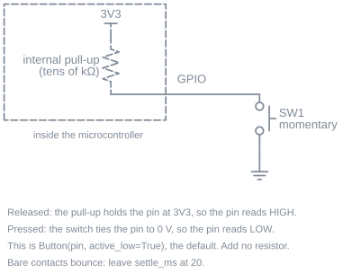
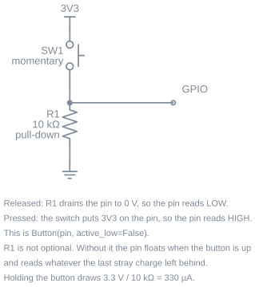
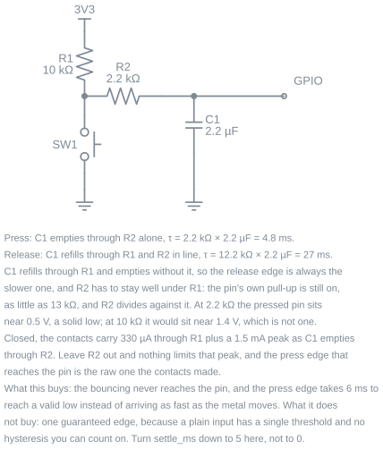

# User Guide

## Overview

A button is a pin that reads 0 or 1.  Turning that into something a program can use takes more than one read: contacts bounce, a tap can be shorter than one pass of your loop, and "held for two seconds" is a different event from "pressed".

`chumicro_buttons` does that work.  `Button` reads one momentary button or switch, `Buttons` reads several keys on one scan, and `KeyMatrix` reads a keypad wired as rows by columns.  All three produce the same readings, so the code you write for one button works unchanged for twelve.

## Getting started

Wire a momentary button between a GPIO pin and GND.  The internal pull-up is switched on for you, so no extra parts are needed.

```python
import board
from chumicro_buttons import Button
from chumicro_timing import ticks, ticks_ms

button = Button(pin=board.GP14, ticks=ticks)

while True:
    now = ticks_ms()
    button.check(now)

    if button.just_pressed:
        print("pressed")
```

`check(now_ms)` does one small step: it collects whatever the hardware captured and updates the readings.  It never waits, so the rest of your program keeps running.

## Reading the button

Every reading is a plain attribute, refreshed by `check()`:

```python
button.pressed          # True while the key is down
button.just_pressed     # True only on the tick the press landed
button.just_released    # True only on the tick the release landed
button.held_ms          # how long it has been down
```

`held_ms` keeps the duration of the press that just ended, so a release handler can ask how long the key was held.  It resets on the next press.

The `just_` family is true for exactly one pass of the loop.  That means you can read it from several places in the same pass without it firing twice, and you never have to remember to clear anything.

`pressed` is the reading that matters for a switch that stays where you put it.  A toggle switch, a reed switch on a door, a slide switch selecting a mode: same object, and the edges are how you notice it moved.

## Presses land even when the loop is slow

A tap is short.  If your program stalls on a socket read or a flash write, a plain pin read looks at the wrong moment and the press is gone.

This library captures the edge when it happens rather than when you get around to asking.  On CircuitPython that is the firmware's own background scan; on MicroPython the library installs a small interrupt handler.  You set none of it up, and there is no capture mode to choose.

The consequence you can see is that durations are measured from the real edge:

```python
button.check(now)
if button.just_pressed:
    print(button.held_ms)      # already non-zero if your loop was busy
```

A press at 100 ms noticed by a loop that got back at 180 ms reports 80 ms held, not 0.  That is the press the person actually performed.

When a signal is so noisy that capture cannot keep up, `button.overflowed` goes true for that tick.  On an ordinary switch you will not see it.  If you do, the wiring section below is the fix.

## Debouncing

A switch is two pieces of metal meeting, and they bounce apart a few times on the way.  A small tactile switch settles in about one to five milliseconds; a bigger toggle or microswitch can take twenty.  Left alone, one press arrives as several.

`settle_ms` is the only setting, and it defaults to 20:

```python
button = Button(pin=board.GP14, ticks=ticks, settle_ms=20)   # the default, good for a tactile switch
button = Button(pin=board.GP14, ticks=ticks, settle_ms=0)    # the signal is already clean
```

The window is a quiet period, not a lockout.  An edge is believed once the signal has held its new state for `settle_ms`, and it is stamped with the moment it changed rather than the moment that became certain.  So raising the number costs you latency and never costs you a press.

Set it to `0` when the button has debouncing hardware behind it.  The next section covers what that hardware looks like and which arrangements actually earn a zero.

## Wiring

### A plain button



Switch between the pin and GND, internal pull-up on.  This is what `Button(pin=...)` sets up for you and it needs no other parts.  The pin reads high until the button pulls it down, which is why `active_low` defaults to `True`.

Wiring to 3V3 instead needs a pull-down resistor of your own, and `active_low=False`:



10 kΩ draws 330 µA while the button is held, which matters on a battery if the button is held often.

### Adding a capacitor

Software debouncing is enough for almost every project.  A capacitor at the pin is worth adding when the wire run is long enough to pick up noise, or when the button feeds something you do not control.



The capacitor slows both edges so the bouncing never reaches the pin.  The two edges are not slowed equally: the capacitor refills through the pull-up but empties through the series resistor alone, giving 4.8 ms on press against 27 ms on release.

The series resistor does two jobs.  It limits the current the contacts carry when the capacitor dumps into them, and it has to stay well under the pull-up, because the pin's own pull-up is still switched on and divides against it.  At 2.2 kΩ the pressed pin sits near 0.5 V, a solid low.  At 10 kΩ it would sit near 1.4 V, which is not a low at all.

With this in place the bouncing is gone before the pin sees it, so turn `settle_ms` down to 5.  Leave it above zero: a plain input has one threshold and no hysteresis you can rely on, so the last word on a clean single edge still belongs to the settle window.  A bigger capacitor does not fix that and makes it worse, because it lengthens the time the signal spends near the threshold.

## Long press, repeat, and clicks

Three duration-driven events sit on top of the edges.  Each is off unless you ask for it, apart from long press which defaults to half a second.

```python
button = Button(
    pin=board.GP14,
    ticks=ticks,
    long_press_ms=500,      # 0 turns long press off
    repeat_ms=200,          # 0 turns auto-repeat off
    repeat_delay_ms=700,    # how long to hold before repeat starts
    click_ms=250,           # 0 turns click counting off
)
```

Long press fires once per press, not once per tick:

```python
if button.just_long_pressed:
    factory_reset()
```

Auto-repeat is what a held arrow key does.  After `repeat_delay_ms`, `just_repeated` comes true every `repeat_ms` until the key is released.  The cadence is anchored to the schedule rather than to your loop, so a slow pass does not stretch it, and a long stall produces one catch-up fire instead of a burst:

```python
if button.just_pressed or button.just_repeated:
    volume += 1
```

Click counting waits `click_ms` after a release to see whether another press follows.  When the series closes, `click_count` holds how many presses were in it:

```python
if button.just_clicked:
    if button.click_count == 1:
        send_status()
    elif button.click_count == 2:
        wake_screen()
```

A single press still reports `just_pressed` immediately.  Click counting adds a later event; it does not delay the earlier one.

A press held for longer than `click_ms` is a hold rather than a click, so it does not add to the count.  That is what keeps a long press from also arriving as a single click.

## Callbacks

If you would rather be called than ask, set the callbacks and let `handle(now_ms)` dispatch them:

```python
button.on_press = lambda: print("down")
button.on_long_press = factory_reset
button.on_click = lambda count: print("clicked", count, "times")

while True:
    now = ticks_ms()
    if button.check(now):
        button.handle(now)
```

`check()` returns True when the tick produced anything, which is the gate `handle()` sits behind.  Your callbacks run in your own loop, in normal context, so they can allocate, print, and raise like any other code.

## Several buttons

`Buttons` reads a group of keys on one scan, which is cheaper than a scan per key and is what makes two keys pressed together land on the same tick:

```python
from chumicro_buttons import Buttons

buttons = Buttons(pins=(board.GP14, board.GP15, board.GP16), ticks=ticks)

while True:
    now = ticks_ms()
    buttons.check(now)

    if buttons[0].just_pressed:
        print("first key")

    if buttons[1].pressed and buttons[2].pressed:
        print("chord")
```

Each `buttons[index]` is a `Button` with its own readings and its own callbacks.  For one handler covering the whole group, the panel carries callbacks that take the key number:

```python
buttons.on_press = lambda key_index: print("key", key_index, "down")
```

## A keypad matrix

A keypad wires its keys as rows by columns so twelve keys need seven pins instead of twelve.  `KeyMatrix` reads that arrangement and gives you the same `Button` objects.

It is imported from its own module rather than from the package, which keeps it off boards that only have discrete buttons:

```python
from chumicro_buttons.matrix import KeyMatrix

keypad = KeyMatrix(
    row_pins=(board.GP2, board.GP3, board.GP4, board.GP5),
    column_pins=(board.GP6, board.GP7, board.GP8),
    ticks=ticks,
)

while True:
    now = ticks_ms()
    keypad.check(now)

    if keypad[0].just_pressed:
        print("top-left key")
```

Keys are numbered row-major, so `row * len(column_pins) + column`.  With the three columns above, key 4 is row 1, column 1.

## Runner pattern

`check(now_ms)` and `handle(now_ms)` are the contract [`chumicro-runner`](https://github.com/ChuMicro/ChuMicro/tree/main/libraries/runner) expects, so a button joins the rest of your services with one line:

```python
from chumicro_runner import Runner

runner = Runner()
runner.add(wifi)
runner.add(button)          # checked every tick, handled when it has news

while True:
    now = runner.tick()
    runner.wait(now)
```

The runner captures one timestamp per pass and shares it with everything, so the button's idea of "now" matches the rest of the program.

## Memory notes

`check()` allocates nothing in steady state.  Edges are drained through a preallocated buffer, the readings are plain attributes written in place, and the loops are indexed by hand rather than iterated.  A program can tick a button forever without the heap growing.

The one tunable is the capture buffer on MicroPython, sized at construction to hold the burst of edges a bouncing contact produces.  If `overflowed` ever comes true on an ordinary press, the switch is bouncing harder than the buffer expects, and the wiring section is a better answer than a bigger buffer.

## Testing

`chumicro_buttons.testing.FakeButtonSource` stands in for the hardware, so press logic is an ordinary unit test with no board and no waiting:

```python
from chumicro_buttons import Button
from chumicro_buttons.testing import FakeButtonSource
from chumicro_timing.testing import FakeTicks


def test_hold_arms_the_reset():
    source = FakeButtonSource()
    button = Button(source=source, ticks=FakeTicks(), long_press_ms=3000)

    source.press(at_ms=100)
    button.check(100)
    button.check(3200)

    assert button.just_long_pressed
```

Each queued edge takes its own `at_ms`, separate from the tick you pass to `check()`, which is how you cover slow-loop behavior on the host.  The [testing page](testing.md) goes further, including chords and the overflow path.

## Platform notes

| Runtime | How presses are captured |
|---|---|
| CircuitPython | The firmware's `keypad` scan, which runs in the background and stamps each edge with the time it happened |
| MicroPython | A capture interrupt the library installs and owns; your code never runs in interrupt context |
| CPython | No GPIO exists, so `pin=` raises and points you at `FakeButtonSource` |

The API is identical on all three.  On CircuitPython the modules this builds on (`keypad`, `digitalio`) are compiled into the firmware, so they cost nothing in your board's storage.

## Examples

| Example | What it shows |
|---|---|
| [`circuitpython_button_toggle.py`](https://github.com/ChuMicro/ChuMicro/blob/main/libraries/buttons/examples/circuitpython_button_toggle.py) | A button flips the onboard LED on CircuitPython (hardware) |
| [`micropython_button_toggle.py`](https://github.com/ChuMicro/ChuMicro/blob/main/libraries/buttons/examples/micropython_button_toggle.py) | The same button on MicroPython (hardware) |

---

<div class="chumicro-footer" markdown>

[← Home](index.md)

[Source](https://github.com/ChuMicro/ChuMicro/tree/main/libraries/buttons) · \
[PyPI](https://pypi.org/project/chumicro-buttons/) · \
[Bundle](https://github.com/ChuMicro/ChuMicro-Bundle) · \
[Experimental Bundle](https://github.com/ChuMicro/ChuMicro-Bundle-Experimental)

</div>
