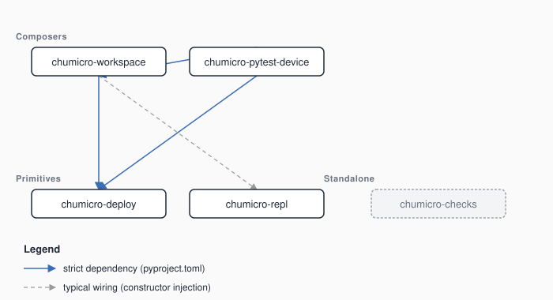

# ChuMicro workbench tools


Host-side tools that run on your laptop and help you manage connected boards.  They run on CPython, install from PyPI, and never get copied onto a device.

<br clear="left">

> Looking for the project README?  → [`/README.md`](../README.md): the LED-blink example, install, and next-step pointers.
>
> Looking for device libraries?  → [`/libraries/`](../libraries/): the cross-runtime libraries that run on the board.

These tools are **optional**.  You can use the [device libraries](../libraries/) without them.  Reach for workbench when you want one command to push code to a board and watch what it prints, a project layout to keep that code in, or a pytest run that executes on real hardware.

## What's in the box?

| Tool | What it does |
|---|---|
| **[deploy](deploy/)** | Push code onto a CircuitPython or MicroPython board, probe its identity, and flash firmware (UF2 or esptool).  Programmatic API plus a `chumicro-deploy` CLI, with a recovery layer that classifies failures and walks you through the fix. |
| **[repl](repl/)** | Serial REPL with traceback highlighting, an `mpremote`-compatible TUI, a `tail()` follow-mode for deploy orchestration, and a programmatic `ReplSession` for headless test fixtures.  `chumicro-repl` CLI. |
| **[workspace](workspace/)** | Host CLI and Python API for ChuMicro project workspaces: `setup` (bootstrap a venv on a freshly cloned workspace), `add-device`, `deploy <project>` (also `--all-devices` / `--all-projects`, and `--tail` to follow the board's output right after the push), `repl` (interactive session or timed serial tail on the selected board), `install-firmware`, `status` / `doctor` health checks, `new --library` / `new --from`, path-aware `rename`, and `update` to re-flow tool-owned template files.  Workspaces are created by cloning the starter repo rather than by a command; it lives at [`ChuMicro-Workbench-Template`](https://github.com/ChuMicro/ChuMicro-Workbench-Template). |
| **[pytest-device](pytest-device/)** | Pytest plugin with three execution targets.  The default, `--target device`, intercepts collection under any `functional_tests/` directory, stages your library and test source onto a connected board via `chumicro-deploy`, runs the test in the device runtime, and reports the on-device outcome through host-side pytest.  `--target device-unit` runs a library's ordinary `tests/` suite on the board instead.  `--target unix-port` runs that same suite in a MicroPython or CircuitPython unix-port subprocess, so you get runtime coverage with nothing plugged in.  Auto-registers via `pytest11`; reads `devices.yml`. |
| **[checks](checks/)** | The workspace lint rules ruff has no check for (`CHU001` onward): descriptive names, publishable-tree isolation, silent test skips, whitespace and line-ending hygiene in doc trees ruff never sees, the no-async-in-library-code contract, and more.  `chumicro-checks` CLI, and `chumicro-workspace lint` runs it alongside ruff by default. |

## Install

Workbench packages live on PyPI only.  There is no bundle and no `.mpy` step, so pip is the whole story:

```bash
pip install chumicro-workspace        # the project CLI: composes deploy, repl, and project layout
pip install chumicro-deploy           # if you only need the deploy primitive
pip install chumicro-repl             # if you only need the REPL helper
pip install chumicro-pytest-device    # pytest plugin
pip install chumicro-checks           # the CHU0NN lint rules on their own
```

`chumicro-workspace` already depends on `chumicro-deploy`, so installing the workspace package brings the deploy primitive along.  The REPL features (the `repl` command, `deploy <project> --tail`, and the post-deploy tail in `deploy-example`) need `chumicro-repl` installed alongside; workspace imports it lazily and prints a one-line install hint if it's missing.

For the experimental channel see [`INSTALL.md`](../INSTALL.md).

## Dependencies



Solid arrows are strict pyproject.toml dependencies.  `pip install chumicro-pytest-device` brings both `chumicro-deploy` and `chumicro-workspace` along, because the plugin dispatches its device-orchestration work to `chumicro_workspace.device_orchestration`.  The dashed arrow is `chumicro-workspace`'s lazy import of `chumicro-repl`: workspace works without it, but the `repl` command and the deploy-then-tail flow need `chumicro-repl` installed alongside.  `chumicro-checks` sits off to the side because no package declares it as a dependency, but it is not unused: `chumicro-workspace lint` runs it by default and stops with an install hint when it isn't present.

The SVG is regenerated from each package's pyproject.toml by [`scripts/render_dep_graph.py`](../scripts/render_dep_graph.py).

## When to reach for workbench

- **"I want a real project layout"** → [ChuMicro-Workbench-Template](https://github.com/ChuMicro/ChuMicro-Workbench-Template) plus [workspace](workspace/).  Clone it and go, with no editing of files live on the device.
- **"I want one command to push code to my board"** → [deploy](deploy/), which handles RAM-mode (mount and execute) and flash-mode (atomic rsync) without you having to think about it.
- **"I want to watch my board's REPL after a deploy"** → [repl](repl/), or `chumicro-workspace deploy <project> --tail` from a [workspace](https://github.com/ChuMicro/ChuMicro-Workbench-Template), which pushes the code and then follows the serial output.
- **"I want my pytest functional tests to run on real hardware"** → [pytest-device](pytest-device/).  Register a board in `devices.yml` and the plugin handles the rest.  With no board on the desk, `--target unix-port` runs the same tests in a unix-port subprocess.
